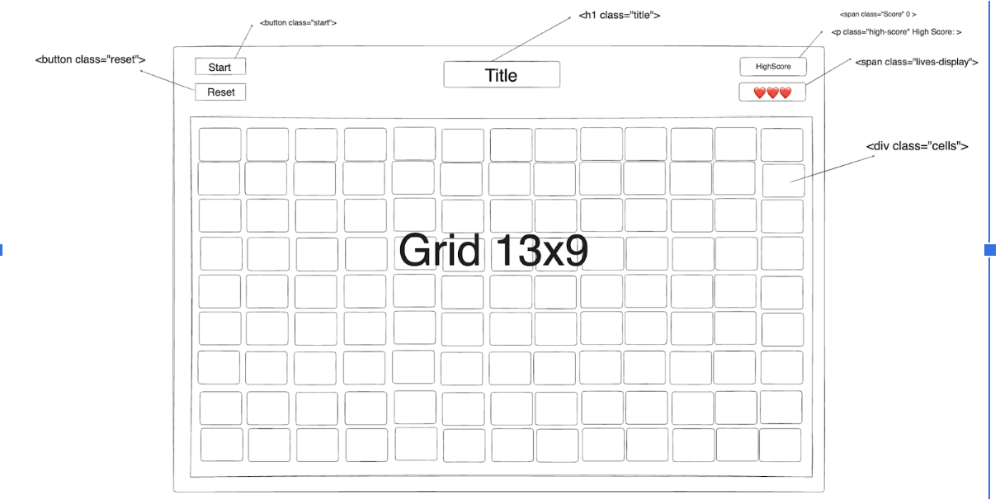
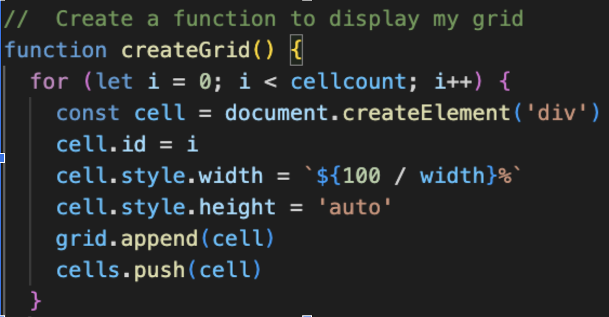
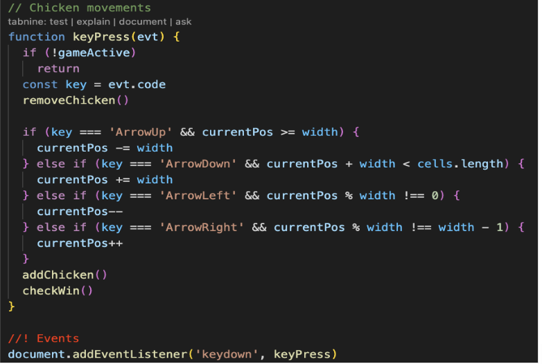
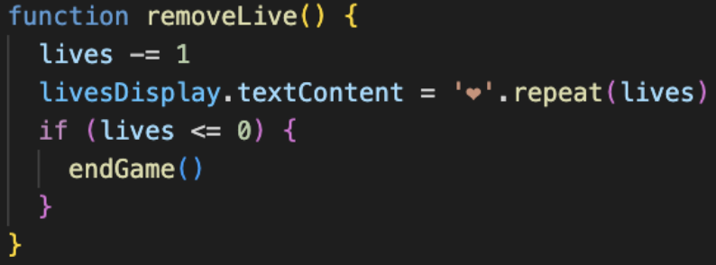
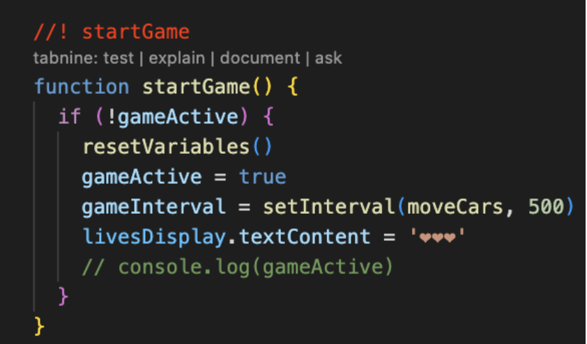
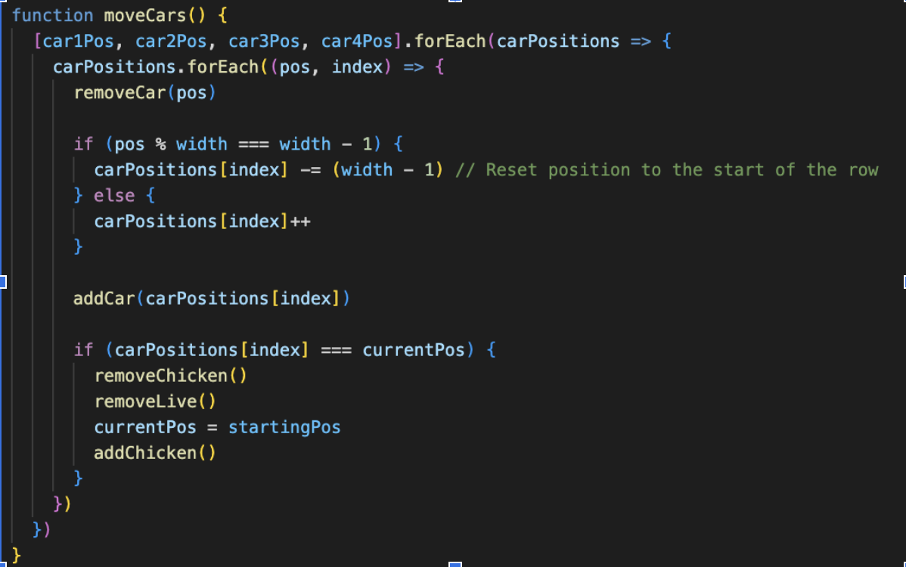
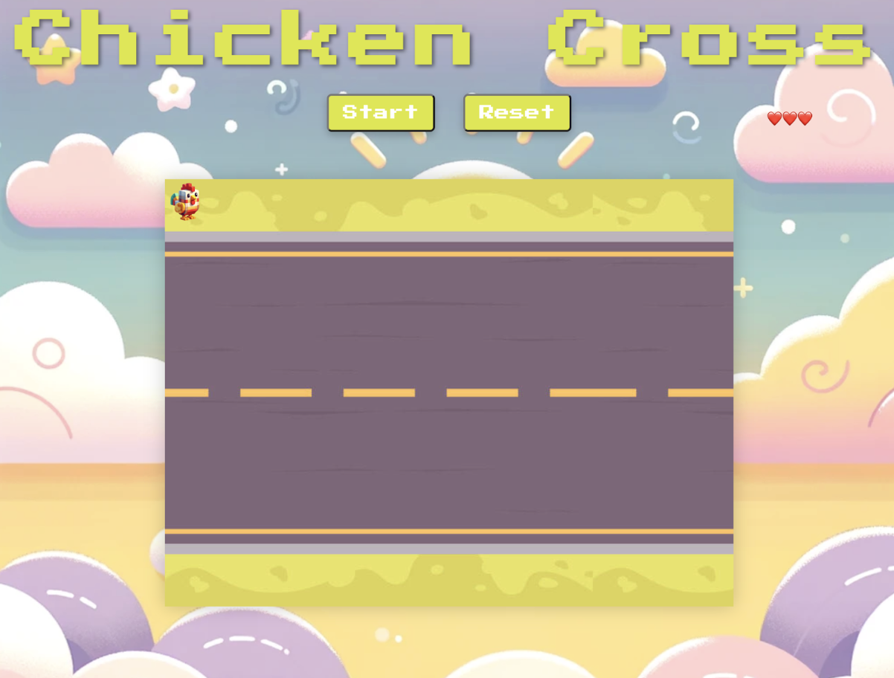

# Project-1
# Chicken Cross

Welcome to Chicken Cross. This is a fun game where you need to think fast and move quickly. You'll help a chicken get past obstacles in its way. The goal is to get the chicken to cross the road by avoiding all the trouble. Let's see if you can do it!

## Play Chicken Cross

Experience the fun and challenge by playing Chicken Cross [Here](https://husaamali1.github.io/Project-1/).

## Project Duration

I started working on this project from Monday, January 22nd, to Monday, January 29th.
I was working solo on this project throughout the time I had to submit it.

## Technologies Used

In this project, my goals were to create a game that fully functioned that was playable for one player and the obstacles should be auto generated.
The technical requirements were to build a grid using JavaScript and using JavaScript for DOM manipulation.Technologies used HTML, CSS, JavaScript. Building a game was an incredible journey, especially when given the opportunity by my instructor to revisit the project after initially facing challenges. This time, I approached it with better preparation and a clear vision, allowing me to carefully plan and execute my ideas, ultimately leading to a more rewarding experience.I learned a lot and solved problems independently.

## Brief

The game meets the following technical requirements:
- Rendered in the browser without using HTML Canvas.
- Built on a grid using JavaScript for a structured layout.
- Logic for winning is designed, and the game visually displays which player won.
- Organised with separate HTML, CSS, and JavaScript files.
- Adherence to KISS (Keep It Simple Stupid) and DRY (Don't Repeat Yourself) principles.
- Deployed online for global access.

## Planning

I will go ahead and show you how I planned my app. Firstly, I started drawing my wireframe on excalidraw. This helped me know how I want my app to look, this made everything much easier for me so I could start coding.

## Development Process

On the first day, I started by sketching your game's layout using Excalidraw, which is an essential step for visualising the game's structure. This planning phase helps in defining the game's architecture and the elements it will contain. For creating the grid using JavaScript and the Document Object Model (DOM), I used  JavaScript. Here's a simplified example of how I have initiated my grid:

Day 2: Implementing Movement and Adding Obstacles Implementing movement for the chicken using arrow keys involves listening for keydown events in JavaScript and updating the position of the chicken based on the key pressed. Here's a basic approach:

For obstacles, I added them to the grid and made them move, which involves setting intervals or timeouts to update their positions over time.

Day 3: I worked on the functionalities for my cars making sure they move from left to right and keep them coming in. I came across a few minor problems and solved them. The problem I faced was that the cars weren't moving. I had a typo fixed. It had the cars moving which was great.

Day 4: I was working on the winning conditions and the lives of the games so my game has 3 lives and when hitting cars 3 times you would lose the game, and the winning area would be right at the bottom would be a win without hitting any of the cars. Here is how I did it:

Day 5: The game was pretty much fully functioning now i wanted to include start and reset button which didn't take too long so now when you click start button it would set and interval if the game not started the cars won't move until press start and reset will reset your lives and send you back to starting position.

Day 6: On this day I just checked for bugs as well and cleaned up my style as much as I could to my ability making sure colours matched up with styling and changing images to make it look better in the game.

## Key Wins

The implementation of car movement and game logic, especially the `moveCars` function, stands out as a significant achievement, enhancing the game's interactivity and fun.

## Challenges

One of the toughest parts was getting the cars to look just right on the screen, especially since I had to switch road images to find the perfect fit for my game. It took some time, but I finally found a road that matched the style I wanted. Also, placing the life icons in the right spot was tricky, and it's something I'm aiming to improve on in future updates.

## Key Learnings

- The importance of visual element selection for an immersive gaming experience.
- Effective color matching and alignment techniques.
- Patience and diligence in debugging for a seamless gameplay experience.

## Current Bugs

- Buttons and life icons placement require further refinement.
- The reset button sometimes unexpectedly triggers a Game Over alert.

## Future Improvements

- Improve UI elements for a cleaner look.
- Introduce a high-score feature to elevate the competitive aspect.
- Develop new levels with varying themes and increasing difficulty.

Thank you for exploring Chicken Cross. Your feedback and suggestions for improvement are always welcome!